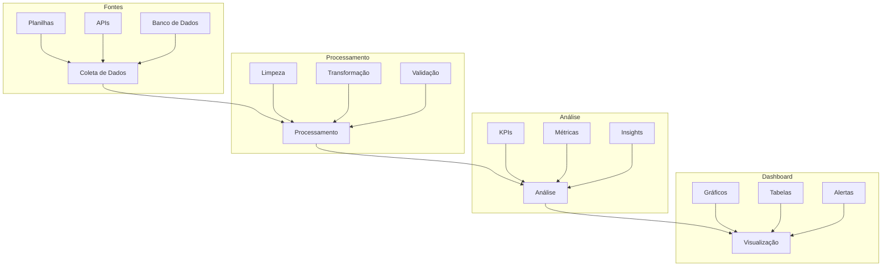

# 💹 Financial Daily Reports Pipeline

<div align="center">

[](https://www.python.org/)
[](https://fastapi.tiangolo.com/)
[](https://streamlit.io/)
[](https://plotly.com/)

<p align="center">
    <h1>Sistema Inteligente de Análise Financeira e Relatórios Diários</h1>
    <h3>🚀 Análise de Dados em Tempo Real | 📊 Dashboards Interativos | 💡 Insights Automáticos</h3>
</p>

</div>

## 🎯 Pipeline de Análise Financeira



## 📊 Exemplos de Visualizações

### 1. Dashboard Principal
[](https://raw.githubusercontent.com/Igorofyeshu4/keepgoing/main/docs/images/main-dashboard.png)

### 2. KPIs Financeiros
[](https://raw.githubusercontent.com/Igorofyeshu4/keepgoing/main/docs/images/financial-kpis.png)

## 💡 Insights e Dicas

### Análise de Demandas
- **Padrões Temporais**
  - 📈 Picos de demanda em início/fim de mês
  - 🕒 Horários com maior volume de solicitações
  - 📅 Sazonalidade mensal/anual

### Otimização de Processos
- **Priorização Inteligente**
  - 🎯 Classificação automática por urgência
  - ⚡ Identificação de gargalos
  - 🔄 Automação de tarefas repetitivas

### Métricas-Chave
- **Indicadores Financeiros**
  ```python
  # Exemplo de cálculo de KPIs
  def calcular_kpis(dados_diarios):
      kpis = {
          "taxa_resolucao": resolvidos / total_demandas * 100,
          "tempo_medio_analise": sum(tempos_analise) / len(demandas),
          "eficiencia_equipe": demandas_resolvidas / horas_trabalhadas
      }
      return kpis
  ```

## 📈 Templates Modernos

### 1. Cards de Métricas
```html
<div class="metric-card glass-effect">
    <div class="metric-header">
        <i class="fas fa-chart-line"></i>
        <h3>Taxa de Resolução</h3>
    </div>
    <div class="metric-value">
        98.5%
        <span class="trend positive">↑ 2.3%</span>
    </div>
</div>
```

### 2. Gráficos Interativos
```python
def criar_grafico_demandas(dados):
    fig = go.Figure()
    
    # Área chart com gradiente
    fig.add_trace(go.Scatter(
        x=dados.data,
        y=dados.demandas,
        fill='tozeroy',
        fillcolor='rgba(73, 176, 230, 0.3)',
        line=dict(color='rgb(73, 176, 230)'),
        name='Demandas Diárias'
    ))
    
    # Configuração do layout moderno
    fig.update_layout(
        template='plotly_dark',
        paper_bgcolor='rgba(0,0,0,0)',
        plot_bgcolor='rgba(0,0,0,0)',
        margin=dict(t=0, l=0, r=0, b=0)
    )
    
    return fig
```

## 🎨 Estilo CSS Moderno
```css
.dashboard-container {
    background: linear-gradient(135deg, #1a1a1a 0%, #2a2a2a 100%);
    border-radius: 20px;
    padding: 2rem;
    box-shadow: 0 8px 32px rgba(0,0,0,0.1);
}

.metric-card {
    background: rgba(255,255,255,0.05);
    backdrop-filter: blur(10px);
    border: 1px solid rgba(255,255,255,0.1);
    border-radius: 15px;
    padding: 1.5rem;
    transition: transform 0.3s ease;
}

.metric-card:hover {
    transform: translateY(-5px);
}
```

## 🚀 Próximos Passos

1. **Automação Avançada**
   - Implementar machine learning para previsão de demanda
   - Criar alertas inteligentes baseados em padrões
   - Desenvolver relatórios automáticos por email

2. **Melhorias de UX**
   - Adicionar temas personalizáveis
   - Implementar modo dark/light
   - Criar dashboards personalizados por usuário

3. **Integrações**
   - Conectar com sistemas ERP
   - Integrar com APIs de mercado financeiro
   - Implementar exportação para múltiplos formatos

---

# Data Analysis and Dashboard Project

Este projeto contém uma coleção de scripts Python para análise de dados, geração de dashboards e APIs para processamento de dados.

## Estrutura do Projeto

```
organized_project/
├── api/              # APIs e serviços web
├── dashboard/        # Dashboards e visualizações
├── scripts/         # Scripts utilitários
├── src/             # Código fonte principal
└── tests/           # Testes unitários e de integração
```

## Dependências

O projeto utiliza Python 3.8+ e as seguintes bibliotecas principais:
- FastAPI para APIs
- Streamlit para dashboards
- Pandas para análise de dados
- Plotly e Altair para visualizações
- Google Sheets API para integração com planilhas

## Instalação

1. Clone o repositório
2. Crie um ambiente virtual:
   ```bash
   python -m venv venv
   source venv/bin/activate  # Linux/Mac
   venv\Scripts\activate     # Windows
   ```
3. Instale as dependências:
   ```bash
   pip install -r requirements.txt
   ```

## Uso

### Dashboard
```bash
streamlit run dashboard/streamlit_app.py
```

### API
```bash
uvicorn api.main:app --reload
```

## Testes
```bash
python -m pytest tests/
```

## Daily Reports Dashboard & Analysis System

Este projeto combina FastAPI e Streamlit para criar um sistema completo de análise e visualização de relatórios diários.

## 🚀 Funcionalidades

- **Dashboard Interativo**
  - Visualização em tempo real de métricas diárias
  - Filtros por data e equipe
  - Gráficos interativos com Plotly
  - Layout responsivo e intuitivo

- **API Robusta**
  - Endpoints RESTful para acesso aos dados
  - Documentação automática com Swagger
  - Sistema de cache para melhor performance
  - Validação de dados com Pydantic

## 📊 Métricas Disponíveis

- **Métricas Principais**
  - Demandas Resolvidas
  - Em Análise
  - Pendentes (Ativo)
  - Pendentes (Receptivo)

- **Métricas Adicionais**
  - Quitados
  - Aprovados
  - Receptivo Total
  - Análise do Dia

## 🛠️ Tecnologias

- **Backend**
  - FastAPI
  - Pydantic
  - Python 3.8+
  - Uvicorn

- **Frontend**
  - Streamlit
  - Plotly
  - Pandas
  - Requests

## 📦 Instalação

1. Clone o repositório:
   ```bash
   git clone https://github.com/Igorofyeshu4/keepgoing.git
   cd keepgoing
   ```

2. Crie e ative o ambiente virtual:
   ```bash
   python -m venv venv
   .\venv\Scripts\activate  # Windows
   ```

3. Instale as dependências:
   ```bash
   pip install -r requirements.txt
   ```

## 🚀 Executando o Projeto

1. Inicie o servidor FastAPI:
   ```bash
   cd api
   uvicorn app.main:app --reload --port 8000
   ```

2. Em outro terminal, inicie o dashboard Streamlit:
   ```bash
   cd api/dashboard
   streamlit run main.py
   ```

3. Acesse:
   - Dashboard: http://localhost:8501
   - API Docs: http://localhost:8000/docs

## 📁 Estrutura do Projeto

```
api/
├── app/
│   ├── api/
│   │   └── endpoints/    # Endpoints da API
│   ├── services/         # Lógica de negócios
│   └── models/          # Modelos de dados
├── dashboard/
│   └── main.py         # Interface Streamlit
└── requirements.txt    # Dependências
```

## 📝 Endpoints da API

- `GET /api/v1/metrics/daily`: Métricas diárias
- `GET /api/v1/metrics/teams`: Lista de equipes
- `GET /api/v1/metrics/date-range`: Intervalo de datas disponível

## 👥 Contribuição

1. Faça um Fork do projeto
2. Crie uma branch para sua feature (`git checkout -b feature/AmazingFeature`)
3. Commit suas mudanças (`git commit -m 'Add some AmazingFeature'`)
4. Push para a branch (`git push origin feature/AmazingFeature`)
5. Abra um Pull Request

# Dashboard de Análise de Demandas Financeiras

## 📊 Visão Geral do Projeto

Este projeto implementa um sistema completo de análise de demandas financeiras, focado em monitorar e otimizar o desempenho das equipes JULIO, LEANDRO e ADRIANO. O sistema utiliza técnicas avançadas de processamento de dados e machine learning para fornecer insights valiosos sobre o fluxo de demandas.

## 🔄 Pipeline do Projeto

### 1. Coleta e Processamento de Dados
- **Fonte**: Arquivos CSV com dados de demandas
- **Processamento**: 
  - Limpeza e normalização dos dados
  - Correção automática de inconsistências
  - Validação de formato e conteúdo

### 2. Análise de Machine Learning
- **Correção de Erros**:
  - Modelo de detecção de anomalias
  - Correção automática de dados inconsistentes
  - Validação cruzada de correções

- **Análise Temporal**:
  - Previsão de demandas futuras
  - Identificação de padrões sazonais
  - Análise de tendências

### 3. Dashboard Interativo
- **Visualizações**:
  - Métricas em tempo real
  - Gráficos comparativos
  - Análise por equipe

- **Funcionalidades**:
  - Filtros dinâmicos
  - Exportação de relatórios
  - Debug avançado

## 📈 Importância das Análises

### Análises Operacionais
1. **Monitoramento de Desempenho**
   - Acompanhamento diário de resoluções
   - Métricas por equipe
   - Tempo médio de resolução

2. **Distribuição de Carga**
   - Balanceamento entre equipes
   - Identificação de gargalos
   - Otimização de recursos

### Análises Estratégicas
1. **Tendências e Padrões**
   - Sazonalidade de demandas
   - Previsão de picos
   - Análise de causas raiz

2. **Tomada de Decisão**
   - Alocação de recursos
   - Planejamento de capacidade
   - Definição de metas

## 🛠️ Estrutura do Projeto

```
organized_project/
├── dashboard/
│   ├── dashboard.py        # Interface principal
│   ├── data_processor.py   # Processamento de dados
│   └── static/             # Recursos estáticos
├── ml_corrections/
│   ├── error_correction_model.py    # Modelo ML para correções
│   ├── apply_corrections.py         # Aplicação de correções
│   └── analyze_demands_timeline.py  # Análise temporal
├── docs/
│   └── *.csv              # Arquivos de dados
└── requirements.txt       # Dependências
```

## 📊 Tipos de Análise

### 1. Análise Quantitativa
- Volume de demandas
- Taxa de resolução
- Tempo médio de atendimento
- Distribuição por status

### 2. Análise Qualitativa
- Padrões de resolução
- Eficiência por equipe
- Qualidade das resoluções
- Satisfação do cliente

### 3. Análise Preditiva
- Previsão de demanda
- Identificação de tendências
- Alertas preventivos
- Otimização de recursos

## 🎯 Benefícios

1. **Operacionais**
   - Maior eficiência no atendimento
   - Redução de tempo de resposta
   - Melhor distribuição de carga

2. **Estratégicos**
   - Tomada de decisão baseada em dados
   - Planejamento proativo
   - Otimização de recursos

3. **Financeiros**
   - Redução de custos
   - Melhor alocação de recursos
   - Aumento de produtividade

## 📝 Como Usar

1. **Instalação**
   ```bash
   pip install -r requirements.txt
   ```

2. **Execução do Dashboard**
   ```bash
   streamlit run dashboard/dashboard.py
   ```

3. **Processamento de Dados**
   ```bash
   python process_demands_csv.py
   ```

4. **Análise ML**
   ```bash
   python ml_corrections/analyze_demands_timeline.py
   ```

## 🔍 Monitoramento e Debug

- Logs detalhados de processamento
- Arquivos de debug em JSON
- Interface de debug no dashboard
- Rastreamento de correções ML

## 🔄 Atualizações Diárias

O sistema processa automaticamente:
- Novos dados de demandas
- Atualizações de status
- Correções e ajustes
- Métricas de desempenho

## 📈 Métricas Principais

1. **Volumetria**
   - Total de demandas
   - Demandas por equipe
   - Taxa de resolução

2. **Tempo**
   - Tempo médio de resolução
   - Tempo por tipo de demanda
   - SLA's

3. **Qualidade**
   - Taxa de sucesso
   - Precisão das resoluções
   - Satisfação do cliente

## 🎯 Objetivos Futuros

1. **Melhorias Técnicas**
   - Automação avançada
   - Integração com outros sistemas
   - APIs para dados externos

2. **Análises Avançadas**
   - Machine Learning avançado
   - Previsões mais precisas
   - Análise de sentimento

3. **Interface**
   - Mais visualizações
   - Relatórios personalizados
   - Alertas inteligentes
