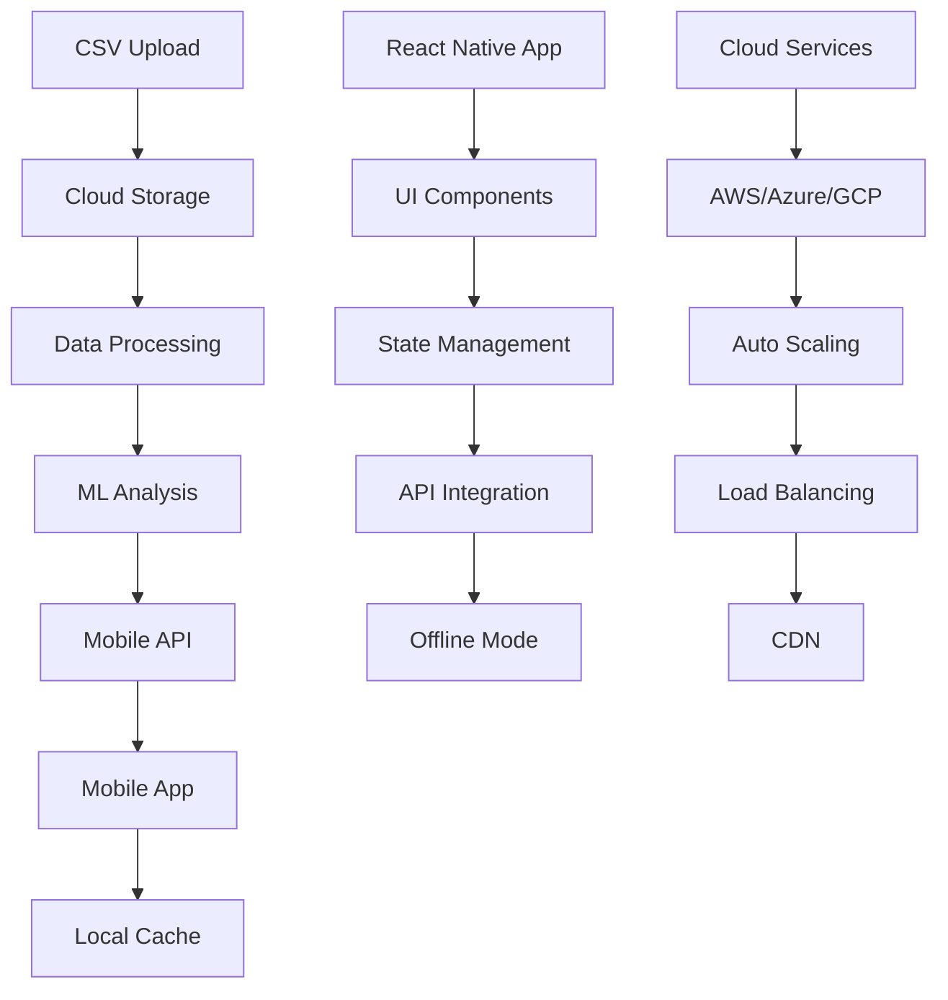
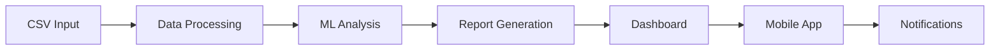

# 📊 RELATÓRIO DIÁRIO COM ANÁLISE GENERATIVA

Sistema Inteligente de Análise Financeira com Dashboard Mobile e Cloud

## 📱 Pipeline Mobile e Cloud

### 📱 Mobile Features
1. **Interface Responsiva**
   - Dashboard adaptativo
   - Gestos intuitivos
   - Modo offline
   - Push notifications

2. **Sincronização em Tempo Real**
   - Cache local
   - Background sync
   - Delta updates
   - Conflict resolution

3. **Segurança Mobile**
   - Biometria
   - Criptografia
   - Token management
   - Secure storage

4. **Performance**
   - Lazy loading
   - Image optimization
   - Bundle splitting
   - Memory management

### ☁️ Cloud Infrastructure
1. **AWS Services**
   - EC2 for hosting
   - S3 for storage
   - RDS for database
   - CloudFront for CDN

2. **Azure Services**
   - App Service
   - Blob Storage
   - SQL Database
   - Functions

3. **Google Cloud**
   - App Engine
   - Cloud Storage
   - Cloud SQL
   - Cloud Functions

## 🤖 Análise Generativa por IA

Nossa plataforma utiliza IA avançada para gerar insights profundos sobre as demandas diárias:

### 1. Previsões Inteligentes
- Análise preditiva de volume de demandas
- Identificação de padrões sazonais
- Previsão de picos de trabalho
- Recomendações de alocação

### 2. Análise de Texto
- Processamento de linguagem natural
- Categorização automática de demandas
- Detecção de prioridades
- Sugestões de resolução

### 3. Insights Automatizados
- Relatórios diários gerados por IA
- Identificação de tendências
- Alertas preventivos
- Recomendações de otimização

### 4. Métricas Avançadas
- Score de eficiência por equipe
- Índice de complexidade das demandas
- Taxa de resolução ponderada
- Previsão de SLA

## 📊 Pipeline de Dados

### 1. Coleta de Dados
- Importação automática de CSV
- Validação de dados
- Normalização
- Enriquecimento

### 2. Processamento
- Limpeza de dados
- Transformação
- Agregação
- Indexação

### 3. Análise
- Machine Learning
- Estatísticas
- Previsões
- Correlações

### 4. Visualização
- Dashboards interativos
- Gráficos em tempo real
- KPIs dinâmicos
- Relatórios automatizados
