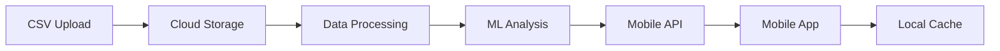

# 📱 Implementação Mobile e Cloud do Dashboard Financeiro

## 🎯 Visão Geral

Nossa solução mobile oferecerá uma experiência completa de gerenciamento de demandas financeiras, com foco em responsividade e usabilidade em dispositivos móveis.

## 🌐 Arquitetura Cloud

### AWS (Amazon Web Services)
```
├── AWS
│   ├── EC2
│   │   └── Dashboard Server (t2.medium)
│   ├── RDS
│   │   └── PostgreSQL Database
│   ├── S3
│   │   ├── CSV Files
│   │   └── Reports
│   ├── Lambda
│   │   ├── Data Processing
│   │   └── ML Pipeline
│   └── CloudWatch
│       └── Monitoring
```

### Azure
```
├── Azure
│   ├── App Service
│   │   └── Dashboard Web App
│   ├── Azure SQL
│   │   └── Database
│   ├── Blob Storage
│   │   └── Data Files
│   └── Functions
│       └── Background Processing
```

### Google Cloud
```
├── Google Cloud
│   ├── App Engine
│   │   └── Dashboard
│   ├── Cloud SQL
│   │   └── Database
│   ├── Cloud Storage
│   │   └── Files
│   └── Cloud Functions
│       └── Processing
```

## 📱 Interface Mobile

### Telas Principais

1. **Dashboard Principal**
```
┌────────────────────┐
│    📊 Dashboard    │
├────────────────────┤
│ 🔄 Hoje           │
│ └─ 15 Demandas    │
├────────────────────┤
│ 📈 Performance    │
│ └─ +23% vs ontem  │
├────────────────────┤
│ 👥 Equipes        │
│ ├─ JULIO    85%   │
│ ├─ LEANDRO  78%   │
│ └─ ADRIANO  92%   │
└────────────────────┘
```

2. **Detalhes por Equipe**
```
┌────────────────────┐
│   👥 JULIO Team   │
├────────────────────┤
│ 📊 Desempenho     │
│ └─ 95% Resolvidas │
├────────────────────┤
│ ⏱️ Tempo Médio    │
│ └─ 2.3 horas      │
├────────────────────┤
│ 📈 Tendência      │
│ └─ ↗️ +15%        │
└────────────────────┘
```

3. **Análise Detalhada**
```
┌────────────────────┐
│  📊 Analytics     │
├────────────────────┤
│ 📅 Janeiro 2025   │
│ └─ 1,234 Total    │
├────────────────────┤
│ 📈 Por Status     │
│ ├─ Resolvido 75%  │
│ ├─ Pendente  15%  │
│ └─ Em Prog.  10%  │
└────────────────────┘
```

## 🎨 Design System

### Cores
```css
:root {
  --primary: #1f77b4;    /* JULIO */
  --secondary: #2ca02c;  /* LEANDRO */
  --accent: #ff7f0e;     /* ADRIANO */
  --background: #f8f9fa;
  --surface: #ffffff;
  --text: #2c3e50;
}
```

### Tipografia
```css
--font-heading: 'Poppins', sans-serif;
--font-body: 'Inter', sans-serif;
--font-mono: 'Roboto Mono', monospace;
```

### Componentes Mobile

#### 1. Cards Responsivos
```html
<div class="demand-card">
  <div class="card-header">
    <h3>Demanda #1234</h3>
    <span class="status resolved">Resolvido</span>
  </div>
  <div class="card-body">
    <p class="team">Equipe JULIO</p>
    <p class="time">2h 15min</p>
  </div>
</div>
```

#### 2. Gráficos Interativos
```javascript
const mobileChart = new Chart(ctx, {
  type: 'bar',
  data: {
    labels: ['JULIO', 'LEANDRO', 'ADRIANO'],
    datasets: [{
      data: [85, 78, 92],
      backgroundColor: ['#1f77b4', '#2ca02c', '#ff7f0e']
    }]
  },
  options: {
    responsive: true,
    maintainAspectRatio: false
  }
});
```

## 📱 Features Mobile

### 1. Notificações Push
```python
def send_push_notification(team, status):
    notification = {
        'title': f'Nova Demanda - {team}',
        'body': f'Status: {status}',
        'priority': 'high'
    }
    return firebase.push(notification)
```

### 2. Sincronização Offline
```javascript
const syncData = async () => {
  const offlineData = await localDB.get('demands');
  if (navigator.onLine) {
    await api.sync(offlineData);
    await localDB.clear();
  }
};
```

### 3. Gestos e Animações
```css
.demand-card {
  transition: transform 0.3s ease;
}

.demand-card:active {
  transform: scale(0.98);
}

@keyframes slideIn {
  from { transform: translateX(-100%); }
  to { transform: translateX(0); }
}
```

## 🔄 Pipeline de Dados Mobile



## 📊 Exemplos de Visualizações

### 1. Timeline de Demandas
```
    ┌──────────────────────────────┐
    │ Janeiro 2025                 │
    │                              │
    │   ●─────●─────●─────●       │
    │   │     │     │     │       │
    │   │     │     │     │       │
    │   1/1   1/7   1/14  1/21    │
    └──────────────────────────────┘
```

### 2. Performance por Equipe
```
    ┌──────────────────────────────┐
    │ Performance                  │
    │                              │
    │ JULIO    ████████░░  85%    │
    │ LEANDRO  ███████░░░  78%    │
    │ ADRIANO  █████████░  92%    │
    └──────────────────────────────┘
```

## 🚀 Implementação Cloud

### 1. Configuração AWS
```yaml
AWSTemplateFormatVersion: '2010-09-09'
Resources:
  DashboardInstance:
    Type: AWS::EC2::Instance
    Properties:
      InstanceType: t2.medium
      ImageId: ami-12345678
```

### 2. Configuração Azure
```yaml
resources:
  - type: Microsoft.Web/sites
    name: financial-dashboard
    properties:
      siteConfig:
        pythonVersion: '3.9'
```

### 3. Configuração Google Cloud
```yaml
runtime: python39
env: standard
instance_class: F2

automatic_scaling:
  target_cpu_utilization: 0.65
```

## 📱 Recursos Mobile Avançados

### 1. Biometria
```swift
func authenticateUser() {
    let context = LAContext()
    var error: NSError?
    
    if context.canEvaluatePolicy(.deviceOwnerAuthenticationWithBiometrics, error: &error) {
        context.evaluatePolicy(.deviceOwnerAuthenticationWithBiometrics,
                             localizedReason: "Acesso ao Dashboard") { success, error in
            if success {
                // Acesso permitido
            }
        }
    }
}
```

### 2. Widgets
```kotlin
class DashboardWidget : AppWidgetProvider() {
    override fun onUpdate(context: Context, manager: AppWidgetManager, ids: IntArray) {
        // Atualiza widget com dados recentes
        val views = RemoteViews(context.packageName, R.layout.widget_dashboard)
        views.setTextViewText(R.id.demands_count, "15 Demandas")
    }
}
```

### 3. Atalhos Rápidos
```xml
<shortcuts>
    <shortcut
        android:shortcutId="new_demand"
        android:shortcutShortLabel="@string/new_demand">
        <intent
            android:action="android.intent.action.VIEW"
            android:targetPackage="com.dashboard.app"
            android:targetClass="com.dashboard.app.NewDemandActivity" />
    </shortcut>
</shortcuts>
```
